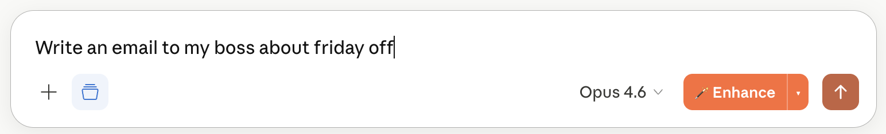
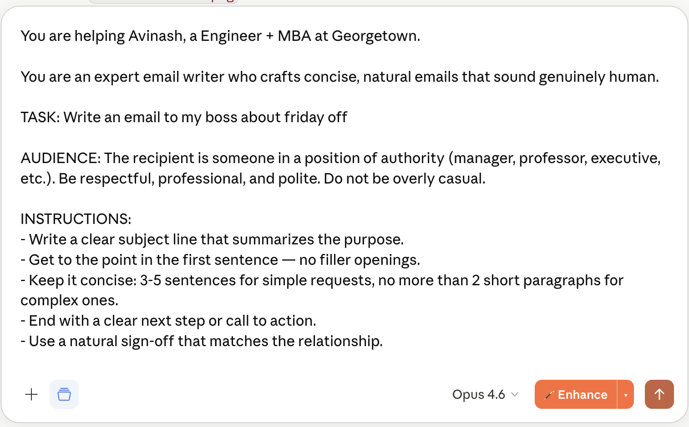
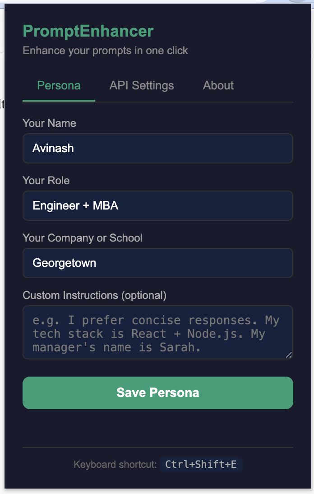
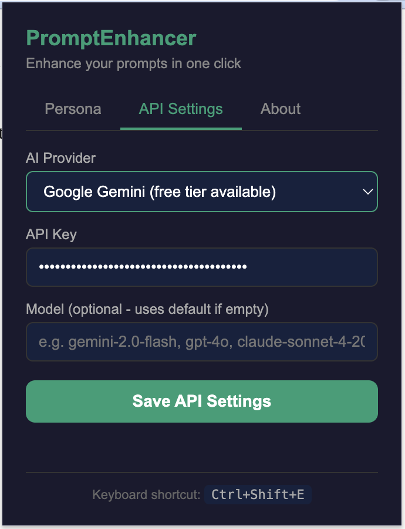

# PromptEnhancer

> Transform short, vague prompts into detailed expert-level instructions — directly inside Claude, ChatGPT, and Gemini.

A Chrome Extension (Manifest V3) that intercepts user input in LLM chat interfaces and rewrites it before submission. Combines a deterministic rule-based NLP engine with optional LLM-powered meta-prompt enhancement across four provider backends. Zero dependencies, zero telemetry, zero external services — all core logic runs client-side with optional user-provided API credentials.

### Before — you type a short prompt


### After — one click transforms it


---


### ✨ Features

### 🪄 One-Click Prompt Rewriting
Injects a native-feel button adjacent to the chat's submit control on Claude, ChatGPT, and Gemini. Single-click invocation or keyboard shortcut (`Ctrl+Shift+E`) rewrites the contents of the active input field with an expert-engineered enhanced prompt. Text replacement is undo-compatible (`Ctrl+Z` restores the original input).

### 🧠 Dual Enhancement Engines
- **Local Engine** — deterministic rule-based NLP with weighted keyword classification across 36 specialized task archetypes, audience detection heuristics, persona injection, and context-aware prompt assembly. Sub-millisecond execution, zero network calls, fully offline-capable.
- **AI Engine** — delegates to a user-configured LLM backend (Gemini, OpenAI, Claude, or Ollama) via a carefully engineered meta-prompt that instructs the target model to act as an expert prompt engineer. Returns higher-quality, context-aware enhancements at the cost of API latency.

### 🎯 Task Archetype Detection
Classifies user intent into one of 36 specialized task types: email, reply, essay, blog, story, speech, report, resume, proposal, meeting notes, code, data analysis, explanation, comparison, research, brainstorm, caption, social post, naming, rewrite, review, translation, summary, recipe, travel planning, advice, complaint, math, science, homework, image generation, UI/UX design, and more. Each archetype maps to a purpose-built template with tailored role assignments, tone specifications, output format constraints, and anti-AI-slop directives.

### 👤 Persona-Aware Context Injection
Persistent user profile (name, role, organization, custom preferences) is injected into the enhanced prompt for task types where identity is semantically relevant (emails, resumes, proposals, speeches, 13 total). For identity-agnostic tasks (math, code, recipes), persona is omitted to avoid noise — user preferences still propagate universally.

### 🌐 Multi-Platform DOM Integration
Platform-specific selectors and injection strategies for:
- **Claude.ai** (Tiptap/ProseMirror editor)
- **ChatGPT** (contentEditable with ProseMirror internals)
- **Google Gemini** (Angular Material input)

MutationObserver-based reconciliation handles dynamic page updates in these single-page applications.

### 🔒 Privacy by Architecture
- All processing runs client-side in isolated content script contexts
- API credentials stored exclusively in `chrome.storage.local` — never transmitted to external servers except the user-selected LLM provider
- No analytics SDK, no telemetry beacons, no third-party scripts
- Content Security Policy compliant, Manifest V3 compliant
- Fully open source — all code, prompts, and templates publicly inspectable in this repository

### ⚙️ Easy Configuration
Set up your persona and optionally connect your AI provider — all from the popup.

| Persona | API Settings |
|---------|-------------|
|  |  |

---

## 🛠️ How It Works

PromptEnhancer injects a button next to your chat's send arrow. When you click it, one of two engines processes your prompt:

### The Local Engine (zero-cost, instant)


```
Input text → Task Classifier → Audience Detector → Template Selector → Prompt Assembler → Output
```

**Task Classifier** — Iterates through 36 task-type definitions, each containing a weighted keyword vocabulary. For each task type, computes a relevance score by summing the length of every matched keyword (longer keywords contribute more, reflecting specificity). The highest-scoring task type is selected; ties fall through to a generic fallback template.

**Audience Detector** — Secondary classifier that scans the input for recipient markers across five audience categories (senior authority, external professional, peer, personal, subordinate). Output modulates the formality, warmth, and directness parameters of the assembled prompt.

**Template Selector** — Each of the 36 task archetypes has a purpose-built template combining role assignment ("You are an expert email writer..."), task-specific instructions, tone parameters, format constraints, and humanization directives (anti-AI-cliché rules, sentence length variation, contraction usage).

**Prompt Assembler** — Composes the final prompt by concatenating: persona block (conditionally included based on task type), role assignment, task statement, audience instruction, domain-specific instructions, tone, format, humanization rules, file-awareness reminder, and conversation-context reminder. Total assembly time is sub-millisecond.


### The AI Engine (uses your API key)

```
Input text + scraped chat history → Meta-prompt construction → Provider adapter → LLM API call → Enhanced prompt
```
**Chat History Scraping** — Platform-specific DOM selectors extract up to the last 10 messages from the visible conversation (role-attributed, truncated to 300 chars per message). Only invoked in AI mode — local mode relies on the target chat's native conversation context instead.

**Meta-prompt Construction** — A single, carefully engineered system prompt instructs the target LLM to act as a senior prompt engineer following ten explicit rules: preserve original intent, inject expert role assignment, add humanization for writing tasks, weave conversation context naturally, respect file attachments, detect audience, preserve voice when refining existing text, add domain-specific knowledge for mentioned tools/companies, output raw text without meta-commentary, and eliminate fluff.

**Provider Adapter Layer** — Four dedicated adapter functions (`callGemini`, `callOpenAI`, `callClaude`, `callOllama`) normalize each provider's distinct request schema, authentication mechanism (`?key=`, `Authorization: Bearer`, `x-api-key`, no-auth for local Ollama), and response structure. All return results through a unified callback contract.

**Graceful Degradation** — If the AI call fails (rate limit, invalid credentials, network error, provider outage), the system silently falls back to the local engine. The user always receives an enhanced prompt; the failure is logged to the console for debugging but never surfaced as an error state.


---

## 📦 Installation

### Option 1: Install from Chrome Web Store (coming soon)

https://chromewebstore.google.com/detail/promptenhancer/hnlohppfjbdpcfaadomcknkcdchegncc

### Option 2: Install manually (developer mode)

1. Clone or download this repository:
```bash
   git clone https://github.com/avi-B-AI-Dev/prompt-enhancer.git
```
2. Open Chrome and navigate to `chrome://extensions`
3. Toggle **Developer mode** on (top-right corner)
4. Click **Load unpacked** and select the cloned folder
5. Pin the extension to your toolbar (click the puzzle icon → pin PromptEnhancer)

### Optional: Configure AI Mode

1. Click the PromptEnhancer icon in your toolbar
2. Go to the **API Settings** tab
3. Choose your provider and paste your API key
4. Click **Save API Settings**

Get a free Gemini API key at [aistudio.google.com](https://aistudio.google.com).

---

## 🏗️ Architecture & Tech Stack

### Stack
- **Chrome Extension (Manifest V3)** — latest extension API with service-worker-less content scripts
- **Vanilla JavaScript (ES5+)** — zero dependencies, zero build step, pure browser-native execution
- **`chrome.storage.local`** — persisted namespace for user configuration with automatic sync across tabs
- **Native Fetch API with Promise chaining** — provider-agnostic HTTP layer for four distinct LLM API contracts
- **MutationObserver API** — event-driven DOM reconciliation for dynamically-rendered SPA targets (Claude, ChatGPT, Gemini)
- **contentEditable manipulation + ProseMirror/Tiptap compatibility layer** — text injection strategy handles rich-text editors, not just textareas

### File Structure
```bash
prompt-enhancer/
├── manifest.json              V3 manifest — permissions, host_permissions, content_scripts
├── icons/                     Extension icons (16, 48, 128 px)
├── lib/
│   └── enhancer.js            Core NLP engine + multi-provider AI orchestration layer
├── content/
│   └── content.js             DOM injection, platform detection, chat scraping, text replacement
└── popup/
├── popup.html             Configuration UI (persona, API credentials, provider selection)
└── popup.js               Storage I/O, form handling, validation
```
### Core Technical Decisions

**Service-worker-less architecture**
All enhancement logic executes in the content script context, eliminating the need for a persistent background service worker. This reduces memory footprint to under 2 MB, removes inter-context message-passing complexity, and sidesteps Manifest V3's service worker lifecycle restrictions (which terminate idle workers after 30 seconds). The tradeoff: we cannot run scheduled background tasks, but the use case doesn't require them.

**Dual enhancement engines with graceful degradation**
The local engine is a deterministic rule-based NLP system — a weighted keyword classifier with 36 specialized task templates, audience detection heuristics, and context-aware prompt assembly. The AI engine delegates to user-provided LLM APIs with a carefully engineered meta-prompt. Both engines share a unified `enhancePrompt()` entry point with automatic fallback: if the AI call fails (rate limit, invalid key, network error), the system silently degrades to the local engine instead of throwing. This ensures 100% request success rate regardless of API state.

**Provider-agnostic AI abstraction**
Each of the four supported providers (Gemini, OpenAI, Claude, Ollama) exposes different API contracts: request schemas, header conventions, response shapes, and authentication mechanisms. The enhancer.js layer implements four dedicated adapter functions (`callGemini`, `callOpenAI`, `callClaude`, `callOllama`) that normalize these differences behind a single `enhanceWithAI()` dispatcher. Adding a new provider requires implementing one adapter — the rest of the system is unchanged. This removes vendor lock-in and lets users optimize for cost, latency, or model quality on a per-task basis.

**Keyword scoring over ML classification**
The local task classifier could be implemented as a neural classifier (e.g., a distilled BERT variant running in-browser via WebAssembly). Instead, it uses length-weighted keyword scoring: longer keywords contribute more to the score, reflecting their higher specificity. This approach is 100x faster (sub-millisecond classification), explainable (users can inspect why a task type was selected), zero-footprint (no model download), and sufficient for the 36-class problem space. The tradeoff of lower accuracy on ambiguous inputs is mitigated by deferring to AI mode when users want higher quality.

**Platform-specific DOM strategies**
Claude uses Tiptap/ProseMirror. ChatGPT uses a different contentEditable implementation. Gemini uses Angular Material components. A naive `element.value = text` works only for textareas — all three platforms use rich text editors that require `execCommand('insertText')` with fallback to direct `textContent` assignment plus synthetic InputEvent dispatch to trigger the underlying state management (React/Angular). The content script includes a three-tier fallback chain to handle all cases without platform-specific branching at the call site.

**Manifest V3 compliance**
Google is deprecating Manifest V2 with hard cutoff in 2025. V3 introduces stricter CSP, eliminates `eval()` and remote code execution, and requires declarative network rules. Starting at V3 means the extension survives the migration and complies with modern extension security standards — critical for Chrome Web Store approval.

---

## 🧪 What This Project Demonstrates

This project was built as a portfolio artifact to demonstrate depth across several domains:

- **LLM System Design** — Meta-prompt engineering, provider-agnostic abstraction layers, graceful degradation between deterministic and ML-based pipelines
- **Applied NLP** — Rule-based classification systems, weighted scoring heuristics, domain-specific template generation for 36 distinct task archetypes
- **Browser Extension Engineering** — Manifest V3 architecture, content script injection, cross-platform DOM manipulation, persistent local storage, event-driven reconciliation via MutationObserver
- **Multi-Provider API Orchestration** — Four distinct LLM provider contracts unified behind a single dispatcher, with adapter pattern for adding new backends
- **Product Thinking** — Dual-mode architecture (free vs AI-powered), user-configurable persona injection, per-prompt user control over cost/quality tradeoffs
- **Privacy-First Design** — Zero telemetry, client-side-only logic, credential isolation, open source by default

## 🛣️ Roadmap

- [ ] **Perplexity and DeepSeek support** — expand platform compatibility
- [ ] **Streaming API responses** — show enhanced prompt as it generates instead of blocking
- [ ] **Project profiles** — multiple saved contexts for different projects (not just one persona)
- [ ] **Enhancement history** — recall and reuse previous enhancements
- [ ] **Custom user templates** — let users define their own task archetypes
- [ ] **Right-click context menu** — enhance selected text on any website
- [ ] **Chrome Web Store publication** — public distribution with install metrics
- [ ] **Multilingual UI** — popup interface translated for non-English users

## 🤝 Contributing

Contributions are welcome. Open an issue to discuss before submitting a PR for significant changes. For small fixes (typos, selector updates when platforms change their DOM), feel free to PR directly.

## 📝 License

MIT License — see [LICENSE](LICENSE) for details.

## 👤 Author

**Avinash Bellam** — Georgetown MBA who codes. Building AI products at the intersection of strategy and engineering.

- GitHub: [@avi-B-AI-Dev](https://github.com/avi-B-AI-Dev)
- LinkedIn: www.linkedin.com/in/avinashbellam

---

*If this extension saved you time, consider giving the repo a ⭐ — it helps with visibility.*
